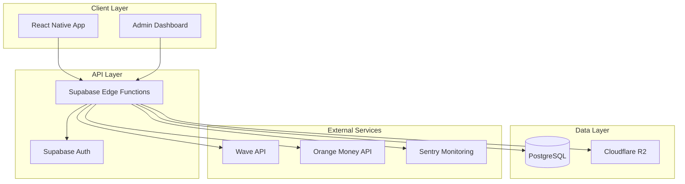

# Documentation Technique Interne Linkart

> Version: v2.0 Auteur: Papa Diop Dernière mise à jour: 2025-10-27 Objet: Documentation technique
> complète pour développeurs et DevOps de la marketplace musicale Linkart

---

## 1. Architecture Générale

### 1.1 Vue d'Ensemble

**Linkart** utilise une architecture **serverless cloud-native** optimisée pour la scalabilité et la
maintenance.



### 1.2 Stack Technique

| Couche              | Technologie                    | Rôle                                 |
| ------------------- | ------------------------------ | ------------------------------------ |
| **Frontend**        | React Native + Expo            | Application mobile cross-platform    |
| **Backend**         | Supabase Edge Functions (Deno) | API serverless                       |
| **Base de données** | PostgreSQL (Supabase)          | Données relationnelles               |
| **Stockage**        | Cloudflare R2                  | Fichiers (beats, previews, contrats) |
| **Auth**            | Supabase Auth                  | Authentification JWT                 |
| **Paiements**       | Wave + Orange Money APIs       | Transactions mobiles                 |
| **Monitoring**      | Sentry                         | Logs et erreurs                      |
| **CI/CD**           | GitHub Actions                 | Déploiement automatique              |

---

## 2. Backend Architecture

### 2.1 Supabase Edge Functions

**Structure des fonctions :**

```
supabase/functions/
├── upload-request/     ← Génération URLs presignées
├── upload-complete/    ← Finalisation upload
├── pay/               ← Initiation paiement
├── payment-callback/  ← Webhook paiement
├── generate-download/ ← URLs téléchargement
├── boost/             ← Système de boosts
├── withdraw/           ← Demandes de retrait
└── _shared/           ← Utilitaires partagés
```

### 2.2 Patterns de Développement

#### Authentification Standard

```typescript
// Pattern standard pour toutes les Edge Functions
import { createClient } from '@supabase/supabase-js';

const supabase = createClient(
  Deno.env.get('SUPABASE_URL')!,
  Deno.env.get('SUPABASE_SERVICE_ROLE_KEY')!
);

// Vérification JWT + capabilities
const authHeader = request.headers.get('Authorization');
if (!authHeader) {
  return new Response('Unauthorized', { status: 401 });
}

const token = authHeader.replace('Bearer ', '');
const {
  data: { user },
  error,
} = await supabase.auth.getUser(token);

if (error || !user) {
  return new Response('Invalid token', { status: 401 });
}

// Vérification capabilities
const { data: userData } = await supabase
  .from('users')
  .select('capabilities')
  .eq('id', user.id)
  .single();

if (!userData.capabilities.can_sell) {
  return new Response('Missing capability', { status: 403 });
}
```

#### Gestion d'Erreurs

```typescript
// Pattern de gestion d'erreurs standardisé
try {
  // Logique métier
} catch (error) {
  console.error('Error in function:', error);

  // Log vers Sentry
  await Sentry.captureException(error);

  return new Response(
    JSON.stringify({
      success: false,
      error: {
        code: 'INTERNAL_ERROR',
        message: 'Une erreur interne est survenue',
      },
    }),
    {
      status: 500,
      headers: { 'Content-Type': 'application/json' },
    }
  );
}
```

### 2.3 Sécurité

#### Row Level Security (RLS)

Toutes les tables sensibles utilisent RLS :

```sql
-- Exemple: users
CREATE POLICY "Users can view own data" ON users
  FOR SELECT USING (auth.uid() = id);

CREATE POLICY "Users can update own data" ON users
  FOR UPDATE USING (auth.uid() = id);

-- Exemple: products
CREATE POLICY "Users can view active products" ON products
  FOR SELECT USING (status = 'active');

CREATE POLICY "Users can manage own products" ON products
  FOR ALL USING (auth.uid() = user_id);
```

#### URLs Presignées

```typescript
// Génération URL presignée R2
import { S3Client, PutObjectCommand } from '@aws-sdk/client-s3';
import { getSignedUrl } from '@aws-sdk/s3-request-presigner';

const s3Client = new S3Client({
  region: 'auto',
  endpoint: `https://${ACCOUNT_ID}.r2.cloudflare.com`,
  credentials: {
    accessKeyId: Deno.env.get('R2_ACCESS_KEY_ID')!,
    secretAccessKey: Deno.env.get('R2_SECRET_ACCESS_KEY')!,
  },
});

const command = new PutObjectCommand({
  Bucket: 'linkart-beats',
  Key: `previews/${userId}/${fileName}`,
  ContentType: contentType,
});

const presignedUrl = await getSignedUrl(s3Client, command, {
  expiresIn: 300, // 5 minutes
});
```

---

## 3. Base de Données

### 3.1 Schéma Principal

#### Tables Core

- **users** : Utilisateurs et capabilities
- **products** : Beats, samples, kits, services
- **transactions** : Paiements et escrow
- **ratings** : Évaluations produits/vendeurs
- **boosts** : Mise en avant payante
- **wallets** : Soldes et historique
- **audit_logs** : Traçabilité des actions

#### Relations Clés

```sql
-- Relations principales
users (1) --> (N) products
users (1) --> (N) transactions (buyer)
users (1) --> (N) transactions (seller)
products (1) --> (N) transactions
transactions (1) --> (N) ratings
users (1) --> (1) wallets
```

### 3.2 Migrations

**Structure des migrations :**

```
supabase/migrations/
├── 20250122000001_initial_schema.sql
├── 20250122000002_rls_policies.sql
└── 20251022085946_create_notifications_table.sql
```

**Commandes de migration :**

```bash
# Créer une nouvelle migration
supabase migration new "add_new_feature"

# Appliquer les migrations
supabase db push

# Générer les types TypeScript
supabase gen types typescript --local > src/types/supabase.ts
```

### 3.3 Index et Performance

```sql
-- Index pour les requêtes fréquentes
CREATE INDEX idx_products_status_type ON products(status, type);
CREATE INDEX idx_products_user_status ON products(user_id, status);
CREATE INDEX idx_transactions_buyer ON transactions(buyer_id);
CREATE INDEX idx_transactions_seller ON transactions(seller_id);
CREATE INDEX idx_transactions_status ON transactions(status);
CREATE INDEX idx_ratings_product ON ratings(product_id);
CREATE INDEX idx_boosts_active ON boosts(status, expires_at);
```

---

## 4. Frontend Architecture

### 4.1 Structure React Native

```
src/
├── components/          # Composants UI réutilisables
│   ├── atoms/           # Boutons, Inputs, Text
│   ├── molecules/       # Cards, Player, Forms
│   └── organisms/       # Listes, Headers, Complexes
├── features/            # Modules métier
│   ├── auth/            # Authentification
│   ├── products/        # Gestion produits
│   ├── uploads/         # Upload fichiers
│   ├── wallet/          # Portefeuille
│   ├── boosts/          # Système boosts
│   └── ratings/         # Évaluations
├── screens/             # Écrans principaux
├── navigation/          # Navigation React Navigation
├── services/            # Appels API
├── hooks/               # Hooks personnalisés
├── theme/               # Système de design
└── types/               # Types TypeScript
```

### 4.2 Patterns de Développement

#### Hooks Personnalisés

```typescript
// Exemple: useProducts
export const useProducts = () => {
  const [products, setProducts] = useState<Product[]>([]);
  const [loading, setLoading] = useState(false);
  const [error, setError] = useState<string | null>(null);

  const fetchProducts = useCallback(async (filters?: ProductFilters) => {
    setLoading(true);
    setError(null);

    try {
      const response = await api.get('/api/products', { params: filters });
      setProducts(response.data.data.products);
    } catch (err) {
      setError(err.message);
    } finally {
      setLoading(false);
    }
  }, []);

  return { products, loading, error, fetchProducts };
};
```

#### Gestion d'État

```typescript
// Zustand store pour l'auth
interface AuthStore {
  user: User | null;
  isAuthenticated: boolean;
  login: (phone: string) => Promise<void>;
  logout: () => void;
  updateProfile: (data: Partial<User>) => Promise<void>;
}

export const useAuthStore = create<AuthStore>((set, get) => ({
  user: null,
  isAuthenticated: false,

  login: async (phone: string) => {
    // Logique de connexion
  },

  logout: () => {
    set({ user: null, isAuthenticated: false });
  },
}));
```

### 4.3 Système de Design

#### Thème Centralisé

```typescript
// theme/index.ts
export const theme = {
  colors: {
    primary: '#1E40AF',
    secondary: '#F59E0B',
    background: '#FFFFFF',
    surface: '#F8FAFC',
    text: '#0F172A',
    error: '#EF4444',
    success: '#10B981',
    warning: '#F59E0B',
  },
  spacing: {
    xs: 4,
    sm: 8,
    md: 16,
    lg: 24,
    xl: 32,
  },
  typography: {
    heading: {
      fontSize: 24,
      fontWeight: 'bold',
    },
    body: {
      fontSize: 16,
      fontWeight: 'normal',
    },
  },
};
```

---

## 5. Tests et Qualité

### 5.1 Stratégie de Tests

#### Tests Unitaires (Jest)

```typescript
// Exemple: test d'un hook
describe('useProducts', () => {
  it('should fetch products successfully', async () => {
    const mockProducts = [{ id: '1', title: 'Test Beat' }];
    jest.spyOn(api, 'get').mockResolvedValue({ data: { data: { products: mockProducts } } });

    const { result } = renderHook(() => useProducts());

    await act(async () => {
      await result.current.fetchProducts();
    });

    expect(result.current.products).toEqual(mockProducts);
    expect(result.current.loading).toBe(false);
  });
});
```

#### Tests d'Intégration

```typescript
// Test d'un endpoint Edge Function
describe('POST /api/products', () => {
  it('should create product with valid data', async () => {
    const productData = {
      title: 'Test Beat',
      type: 'beat',
      price: 50000,
    };

    const response = await fetch('/api/products', {
      method: 'POST',
      headers: { Authorization: `Bearer ${validToken}` },
      body: JSON.stringify(productData),
    });

    expect(response.status).toBe(201);
    const data = await response.json();
    expect(data.success).toBe(true);
  });
});
```

### 5.2 Qualité de Code

#### ESLint Configuration

```javascript
// .eslintrc.js
module.exports = {
  extends: ['expo', '@react-native', '@typescript-eslint/recommended'],
  rules: {
    '@typescript-eslint/no-explicit-any': 'warn',
    'react-hooks/exhaustive-deps': 'warn',
    'no-console': 'warn',
  },
};
```

#### Pre-commit Hooks

```bash
# .husky/pre-commit
#!/bin/sh
node scripts/pre-commit-checks.js
```

---

## 6. CI/CD et Déploiement

### 6.1 GitHub Actions

#### Workflow Principal

```yaml
# .github/workflows/ci.yml
name: CI/CD Pipeline

on:
  push:
    branches: [master]
  pull_request:
    branches: [master]

jobs:
  test:
    runs-on: ubuntu-latest
    steps:
      - uses: actions/checkout@v3
      - uses: actions/setup-node@v3
      - run: npm ci
      - run: npm run lint
      - run: npm run test
      - run: npm run type-check

  deploy-supabase:
    if: github.ref == 'refs/heads/master'
    runs-on: ubuntu-latest
    steps:
      - uses: actions/checkout@v3
      - run: supabase db push --project-ref ${{ secrets.SUPABASE_PROJECT_REF }}
      - run: supabase functions deploy --project-ref ${{ secrets.SUPABASE_PROJECT_REF }}
```

### 6.2 Déploiement

#### Supabase Edge Functions

```bash
# Déploiement des fonctions
supabase functions deploy --project-ref $SUPABASE_PROJECT_REF

# Déploiement des migrations
supabase db push --project-ref $SUPABASE_PROJECT_REF
```

#### Application Mobile

```bash
# Build avec EAS
eas build --platform all

# Submit vers stores
eas submit --platform all
```

---

## 7. Monitoring et Observabilité

### 7.1 Sentry Integration

```typescript
// Configuration Sentry
import * as Sentry from '@sentry/react-native';

Sentry.init({
  dsn: process.env.EXPO_PUBLIC_SENTRY_DSN,
  environment: process.env.NODE_ENV,
});

// Capture d'erreurs
try {
  // Code risqué
} catch (error) {
  Sentry.captureException(error);
}
```

### 7.2 Logs et Métriques

#### Logs Structurés

```typescript
// Pattern de logging
const logTransaction = (transactionId: string, action: string, metadata: any) => {
  console.log(
    JSON.stringify({
      timestamp: new Date().toISOString(),
      level: 'info',
      service: 'linkart-api',
      transactionId,
      action,
      metadata,
    })
  );
};
```

#### Métriques Business

- **GMV** : Volume transactions total
- **Commission Revenue** : Revenus plateforme
- **Active Users** : Utilisateurs actifs
- **Conversion Rate** : Taux de conversion
- **Upload Success Rate** : Taux de succès upload

---

## 8. Troubleshooting

### 8.1 Problèmes Courants

#### Edge Functions

```bash
# Vérifier les logs
supabase functions logs --project-ref $PROJECT_REF

# Debug local
supabase functions serve --debug
```

#### Base de Données

```sql
-- Vérifier les connexions actives
SELECT * FROM pg_stat_activity;

-- Vérifier les locks
SELECT * FROM pg_locks;
```

#### React Native

```bash
# Nettoyer le cache
npx expo start --clear

# Reset Metro
npx react-native start --reset-cache
```

### 8.2 Performance

#### Optimisations Base de Données

- Index sur les colonnes fréquemment requêtées
- Pagination pour les grandes listes
- Cache des requêtes coûteuses

#### Optimisations Frontend

- Lazy loading des composants
- Memoization des calculs coûteux
- Optimisation des images

---

## 9. Changelog

### v2.0 (2025-10-27)

- Documentation complète selon les règles du projet
- Architecture détaillée avec diagrammes
- Patterns de développement standardisés
- Guide de sécurité et RLS
- Stratégie de tests et qualité
- CI/CD et déploiement
- Monitoring et troubleshooting

### v1.0 (2025-10-22)

- Création de la structure de documentation technique
- Migration des documents existants
