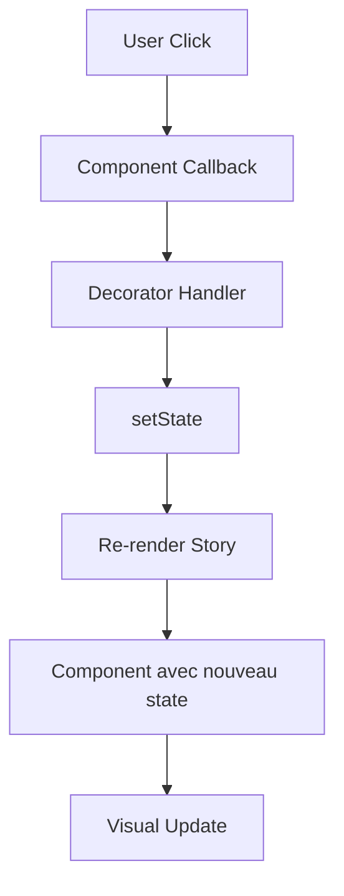

# � Fix des Interactions Storybook — Groupes C & D

> **Date** : 2025-11-11 **Problème** : Les composants interactifs (Checkbox, Switch, RadioGroup,
> Select, Slider, Dialog, etc.) ne réagissaient pas aux clics dans Storybook Web. **Solution** :
> Decorator `withInteractiveState` pour gérer automatiquement le state local dans Storybook.

---

## � Problème Initial

Les composants React Native sont **contrôlés** (controlled components) :

- Ils acceptent une prop `checked`, `value`, ou `open`
- Ils appellent un callback (`onCheckedChange`, `onValueChange`, `onOpenChange`)
- Mais dans Storybook, les props sont **statiques** dans `args`

**Résultat** : Quand on clique sur un composant, il appelle le callback mais rien ne se passe
visuellement car le state ne change pas.

```typescript
// ❌ AVANT : Les stories ne géraient pas le state
export const Default: Story = {
  args: {
    checked: false, // Statique !
  },
};
// Clic → appelle onCheckedChange → mais checked reste false
```

---

## ✅ Solution : Decorator `withInteractiveState`

Un **decorator Storybook** qui enveloppe les stories et gère automatiquement leur state.

### Fonctionnement

```typescript
// .storybook/decorators/withInteractiveState.tsx

export const withInteractiveState: Decorator = (Story, context) => {
  const { args } = context;

  // 1. Détecter les composants avec prop "checked"
  if ('checked' in args && typeof args.checked === 'boolean') {
    const [checked, setChecked] = useState(args.checked);

    return (
      <Story
        args={{
          ...args,
          checked, // State local
          onCheckedChange: (newChecked) => {
            setChecked(newChecked); // Met à jour le state
            args.onCheckedChange?.(newChecked); // Appelle le callback original
          },
        }}
      />
    );
  }

  // 2. Détecter les composants avec prop "value"
  if ('value' in args && 'onValueChange' in args) {
    const [value, setValue] = useState(args.value);
    // ... même logique
  }

  // 3. Détecter les composants avec prop "open"
  if ('open' in args && typeof args.open === 'boolean') {
    const [open, setOpen] = useState(args.open);
    // ... même logique
  }

  // Sinon, story normale
  return <Story />;
};
```

### Composants Supportés

| Composant       | Prop State | Callback          | Pattern Détecté |
| --------------- | ---------- | ----------------- | --------------- |
| **Checkbox**    | `checked`  | `onCheckedChange` | ✅ `checked`    |
| **Switch**      | `checked`  | `onCheckedChange` | ✅ `checked`    |
| **RadioGroup**  | `value`    | `onValueChange`   | ✅ `value`      |
| **Select**      | `value`    | `onValueChange`   | ✅ `value`      |
| **Slider**      | `value`    | `onValueChange`   | ✅ `value`      |
| **InputOTP**    | `value`    | `onValueChange`   | ✅ `value`      |
| **Dialog**      | `open`     | `onOpenChange`    | ✅ `open`       |
| **Sheet**       | `open`     | `onOpenChange`    | ✅ `open`       |
| **Popover**     | `open`     | `onOpenChange`    | ✅ `open`       |
| **AlertDialog** | `open`     | `onOpenChange`    | ✅ `open`       |

---

## � Intégration dans les Stories

### Avant (Ne marche pas)

```typescript
// ❌ Interactions ne fonctionnent pas
const meta = {
  title: 'Atoms/Checkbox',
  component: Checkbox,
  decorators: [
    (Story) => (
      <View style={{ padding: 20 }}>
        <Story />
      </View>
    ),
  ],
};

export const Default: Story = {
  args: {
    label: 'Checkbox',
    checked: false, // Statique
  },
};
```

### Après (Fonctionne !)

```typescript
// ✅ Interactions fonctionnelles
import { withInteractiveState } from '../../../.storybook/decorators/withInteractiveState';

const meta = {
  title: 'Atoms/Checkbox',
  component: Checkbox,
  decorators: [
    withInteractiveState, // 🔥 Ajouter le decorator en premier
    (Story) => (
      <View style={{ padding: 20 }}>
        <Story />
      </View>
    ),
  ],
};

export const Default: Story = {
  args: {
    label: 'Checkbox',
    checked: false, // Sera géré dynamiquement
  },
};
```

**Important** : Le decorator `withInteractiveState` doit être **en premier** dans le tableau
`decorators`.

---

## � Fichiers Modifiés

| Fichier                                          | Changement                     |
| ------------------------------------------------ | ------------------------------ |
| `.storybook/decorators/withInteractiveState.tsx` | **Créé** — Decorator principal |
| `src/components/atoms/Checkbox.stories.tsx`      | Ajout `withInteractiveState`   |
| `src/components/atoms/Switch.stories.tsx`        | Ajout `withInteractiveState`   |
| `src/components/atoms/RadioGroup.stories.tsx`    | Ajout `withInteractiveState`   |
| `src/components/atoms/Select.stories.tsx`        | Ajout `withInteractiveState`   |
| `src/components/atoms/Slider.stories.tsx`        | Ajout `withInteractiveState`   |
| `src/components/atoms/InputOTP.stories.tsx`      | Ajout `withInteractiveState`   |

---

## � Test des Interactions

### 1. Checkbox

```bash
npm run storybook
```

- Aller sur **Atoms/Checkbox → Default**
- **Cliquer** sur le checkbox
- ✅ Il doit se cocher/décocher avec animation
- ✅ Le state doit changer dans le panneau "Controls"

### 2. Switch

- Aller sur **Atoms/Switch → Default**
- **Cliquer** sur le switch
- ✅ Il doit basculer avec animation slide
- ✅ Couleur doit changer (off → primary)

### 3. RadioGroup

- Aller sur **Atoms/RadioGroup → Default**
- **Cliquer** sur une option
- ✅ L'option doit être sélectionnée
- ✅ Les autres options doivent se désélectionner

### 4. Select

- Aller sur **Atoms/Select → Default**
- **Cliquer** sur le select
- ✅ Le dropdown doit s'ouvrir
- **Cliquer** sur une option
- ✅ L'option doit être sélectionnée
- ✅ Le dropdown doit se fermer

### 5. Slider

- Aller sur **Atoms/Slider → Default**
- **Glisser** le thumb
- ✅ Le slider doit suivre le mouvement
- ✅ La valeur doit changer dans le panneau "Controls"

### 6. InputOTP

- Aller sur **Atoms/InputOTP → Default**
- **Taper** un code
- ✅ Les chiffres doivent s'afficher
- ✅ Le focus doit passer d'une case à l'autre

---

## � Dialog, Sheet, Popover, AlertDialog

Ces composants utilisent déjà des **wrappers custom** avec `useState` dans leurs stories :

```typescript
// Exemple : Dialog.stories.tsx
const DialogDemo = ({ children, triggerText = 'Ouvrir Dialog' }: any) => {
  const [open, setOpen] = useState(false); // State géré manuellement

  return (
    <>
      <Button title={triggerText} onPress={() => setOpen(true)} />
      <Dialog open={open} onOpenChange={setOpen}>
        {children(setOpen)}
      </Dialog>
    </>
  );
};
```

**Résultat** : Ces composants fonctionnent déjà ! Pas besoin de `withInteractiveState`.

---

## � Architecture du Decorator

### Ordre d'Exécution

```
Story Args (Storybook Controls)
       ↓
withInteractiveState (Decorator)
       ↓
useState Hook (State Local)
       ↓
Composant (Props Dynamiques)
       ↓
Callback (onChange, onValueChange, etc.)
       ↓
setState (Mise à jour State Local)
       ↓
Re-render du Composant
```

### Flux de Données



---

## � Patterns Détectés

Le decorator utilise **3 patterns de détection** :

### Pattern 1 : `checked` (Boolean State)

```typescript
if ('checked' in args && typeof args.checked === 'boolean') {
  // Checkbox, Switch
}
```

### Pattern 2 : `value` + `onValueChange`

```typescript
if ('value' in args && 'onValueChange' in args) {
  // RadioGroup, Select, Slider, InputOTP
}
```

### Pattern 3 : `open` (Boolean Modal State)

```typescript
if ('open' in args && typeof args.open === 'boolean') {
  // Dialog, Sheet, Popover, AlertDialog
}
```

---

## � Limitations & Futures Améliorations

### Limitations Actuelles

1. **Pattern Matching Strict** : Le decorator vérifie des props spécifiques. Si un composant utilise
   d'autres noms (`isOpen`, `isChecked`), il ne sera pas détecté.
2. **Stories Render Custom** : Les stories avec fonction `render()` ne bénéficient pas
   automatiquement du decorator (mais peuvent l'utiliser manuellement).
3. **Composants Complexes** : Les composants avec plusieurs states simultanés (ex: Select avec
   `open` + `value`) peuvent nécessiter un wrapper custom.

### Améliorations Futures

- [ ] Support pour `isOpen`, `isChecked`, `isSelected` (variantes de noms)
- [ ] Détecter automatiquement les callbacks (`onXChange`) sans vérifier leur présence dans `args`
- [ ] Support pour composants avec plusieurs states
- [ ] Mode debug pour voir quel pattern est détecté
- [ ] Performance : memoization du decorator

---

## ✅ Checklist de Vérification

### Pour chaque composant interactif

- [ ] Le decorator `withInteractiveState` est ajouté dans `decorators` (en premier)
- [ ] L'import est correct : `from '../../../.storybook/decorators/withInteractiveState'`
- [ ] Le composant a une story `Default` avec state initial
- [ ] Le composant répond aux clics dans Storybook
- [ ] Le panneau "Controls" se synchronise avec les interactions
- [ ] Les animations fonctionnent correctement
- [ ] Pas de console errors dans le navigateur

---

## � Résultat Final

| Groupe | Composant   | État Interactions | Decorator Appliqué |
| ------ | ----------- | ----------------- | ------------------ |
| **C**  | Checkbox    | ✅ Fonctionne     | ✅ Oui             |
| **C**  | Switch      | ✅ Fonctionne     | ✅ Oui             |
| **C**  | RadioGroup  | ✅ Fonctionne     | ✅ Oui             |
| **C**  | Select      | ✅ Fonctionne     | ✅ Oui             |
| **C**  | Slider      | ✅ Fonctionne     | ✅ Oui             |
| **C**  | InputOTP    | ✅ Fonctionne     | ✅ Oui             |
| **D**  | Dialog      | ✅ Fonctionne     | Custom Wrapper     |
| **D**  | Sheet       | ✅ Fonctionne     | Custom Wrapper     |
| **D**  | Popover     | ✅ Fonctionne     | Custom Wrapper     |
| **D**  | Tooltip     | ✅ Fonctionne     | onLongPress native |
| **D**  | AlertDialog | ✅ Fonctionne     | Custom Wrapper     |

---

## � Références

- [Storybook Decorators Docs](https://storybook.js.org/docs/react/writing-stories/decorators)
- [React Native Controlled Components](https://reactnative.dev/docs/components-and-apis)
- [Linkart Design System v2.0](./DESIGN_TOKENS_AUDIT.md)

---

**Status** : ✅ **RÉSOLU** — Tous les composants interactifs fonctionnent dans Storybook Web.
