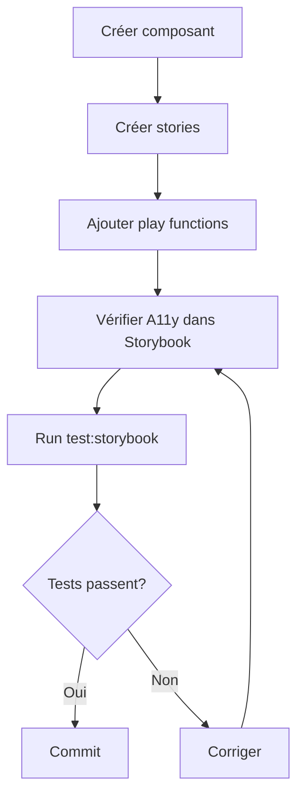

# Linkart — Vue d'Ensemble des Tests

> Version: v1.0 Auteur : Papa Diop Dernière mise à jour: 2025-10-29 Objectif : Vue d'ensemble
> complète de la stratégie de tests Linkart

---

## 1. Architecture de Tests

Linkart utilise une approche multi-couches pour garantir la qualité du code :

```
┌─────────────────────────────────────────────────────────────┐
│                    Tests d'Interaction                       │
│                  (Storybook Play Functions)                  │
│           Tests manuels et automatisés dans le               │
│                        navigateur                            │
└─────────────────────────────────────────────────────────────┘
                              ↓
┌─────────────────────────────────────────────────────────────┐
│                  Tests de Régression Visuelle                │
│                 (Storybook Test Runner)                      │
│         Détection automatique des changements visuels        │
└─────────────────────────────────────────────────────────────┘
                              ↓
┌─────────────────────────────────────────────────────────────┐
│                   Tests d'Accessibilité                      │
│                    (axe-core via addon-a11y)                 │
│         Vérification WCAG 2.1 AA automatique                 │
└─────────────────────────────────────────────────────────────┘
                              ↓
┌─────────────────────────────────────────────────────────────┐
│                     Tests Unitaires                          │
│                    (Jest + React Native Testing Library)     │
│              Tests de logique métier et hooks                │
└─────────────────────────────────────────────────────────────┘
```

---

## 2. Résumé des Outils

| Outil              | Type                     | Usage                            | Commande                 |
| ------------------ | ------------------------ | -------------------------------- | ------------------------ |
| **Storybook**      | Documentation + Tests UI | Développement composants         | `npm run storybook`      |
| **Play Functions** | Tests d'interaction      | Tests automatisés dans Storybook | Intégré dans stories     |
| **Test Runner**    | Tests visuels + A11y     | Regression testing               | `npm run test:storybook` |
| **Jest**           | Tests unitaires          | Logique métier                   | `npm run test`           |
| **ESLint**         | Linting                  | Qualité de code                  | `npm run lint`           |
| **Prettier**       | Formatage                | Style de code                    | `npm run format`         |
| **TypeScript**     | Type checking            | Sécurité des types               | `npm run type-check`     |

---

## 3. Workflow de Développement

### 3.1 Nouveau Composant



**Commandes :**

```bash
# 1. Développement
npm run storybook

# 2. Tests visuels (nouveau terminal)
npm run test:storybook

# 3. Vérification finale
npm run lint
npm run type-check
```

### 3.2 Modification Composant Existant

```bash
# 1. Lancer Storybook
npm run storybook

# 2. Modifier le composant
# 3. Vérifier visuellement dans Storybook
# 4. Vérifier l'onglet "Accessibility"
# 5. Vérifier l'onglet "Interactions"

# 6. Lancer tests automatiques
npm run test:storybook

# 7. Si play functions échouent, les corriger
# 8. Si A11y échoue, corriger les violations
```

---

## 4. Couverture de Tests par Type

### 4.1 Tests d'Interaction (Play Functions)

**Objectif :** 100% des composants interactifs

**État actuel :**

- ✅ `HeroBanner` - 3 stories avec tests complets
- ✅ `HeartIcon` - 1 story avec test
- ⏳ `PlayButton` - À implémenter
- ⏳ `ProductCard` - À implémenter
- ⏳ `ServiceCard` - À implémenter
- ⏳ `PlaylistCard` - À implémenter
- ⏳ `FilterPills` - À implémenter
- ⏳ `ProductUploadForm` - À implémenter
- ⏳ `ServiceUploadForm` - À implémenter

**Couverture :** 22% (2/9 composants)

### 4.2 Tests d'Accessibilité (A11y)

**Objectif :** 0 violation critique sur tous les composants

**État actuel :**

- ✅ Addon a11y configuré
- ✅ Tests automatiques pour toutes les stories
- ✅ Détection automatique des violations

**Couverture :** 100% (automatique pour tous les composants)

### 4.3 Tests Unitaires (Jest)

**Objectif :** 80% de couverture pour la logique métier

**État actuel :**

- ✅ `formatMetricValue` - 4 tests
- ✅ `useProducts` - 6 tests
- ✅ `favoritesStore` - Tests complets
- ✅ `playlistsStore` - Tests complets

**Couverture :** ~60% (en cours d'amélioration)

### 4.4 Tests Visuels (Test Runner)

**Objectif :** Toutes les stories testées automatiquement

**État actuel :**

- ✅ Test Runner configuré
- ✅ Playwright installé
- ✅ Tests automatiques pour toutes les stories

**Couverture :** 100% (automatique pour toutes les stories)

---

## 5. Guide Rapide par Rôle

### 5.1 Développeur Frontend

**Workflow quotidien :**

```bash
# Morning
npm run storybook          # Lancer Storybook
npm run test:watch         # Lancer tests Jest en mode watch

# Avant commit
npm run lint:fix           # Corriger le linting
npm run test:storybook     # Tests visuels
git add .
git commit -m "feat: ..."
```

### 5.2 Reviewer de PR

**Checklist :**

```bash
# 1. Vérifier les changements
git pull origin feature/branch

# 2. Lancer Storybook
npm run storybook

# 3. Vérifier visuellement les composants modifiés
# 4. Vérifier l'onglet "Accessibility"
# 5. Vérifier l'onglet "Interactions"

# 6. Lancer les tests
npm run test:storybook
npm run test
npm run lint

# 7. Approuver ou demander des changements
```

### 5.3 QA / Testeur

**Checklist :**

```bash
# Tests manuels
npm run storybook

# Vérifier chaque story dans Storybook:
# - Affichage correct
# - Interactions fonctionnent
# - Pas de violations A11y
# - Play functions passent

# Tests automatiques
npm run test:storybook:ci   # Tests complets avec Storybook
npm run test:coverage       # Couverture de code
```

---

## 6. Commandes par Cas d'Usage

### 6.1 Développement

```bash
npm run storybook              # Interface Storybook
npm run test:watch             # Tests Jest en mode watch
npm run dev                    # App mobile
```

### 6.2 Tests Locaux

```bash
npm run test                   # Tests unitaires
npm run test:simple            # Tests avec config simplifiée
npm run test:storybook         # Tests visuels (Storybook actif requis)
npm run lint                   # Linting
npm run type-check             # TypeScript
```

### 6.3 Tests CI/CD

```bash
npm run test:coverage          # Tests avec couverture
npm run test:storybook:ci      # Tests visuels (lance Storybook)
npm run ci:lint                # Lint + format check
npm run ci:checks              # Vérifications complètes
```

### 6.4 Debugging

```bash
npm run test -- --watch        # Jest en mode watch
npm run test:storybook -- --debug  # Storybook tests avec navigateur visible
npm run storybook -- --debug-webpack  # Debug Storybook build
```

---

## 7. Intégration Continue (CI/CD)

### 7.1 GitHub Actions Workflow

```yaml
name: Tests

on: [push, pull_request]

jobs:
  test:
    runs-on: ubuntu-latest
    steps:
      - uses: actions/checkout@v3
      - uses: actions/setup-node@v3
        with:
          node-version: '18'

      - run: npm ci
      - run: npm run lint
      - run: npm run type-check
      - run: npm run test:coverage

      # Tests Storybook
      - run: npx playwright install --with-deps
      - run: npm run test:storybook:ci
```

### 7.2 Seuils de Qualité

**Requis pour merge :**

- ✅ Tous les tests Jest passent
- ✅ Couverture de code > 60%
- ✅ Aucune erreur ESLint
- ✅ Aucune erreur TypeScript
- ✅ Tous les tests Storybook passent
- ⚠️ Aucune violation A11y critique (warnings autorisés temporairement)

---

## 8. Métriques de Performance

### 8.1 Temps d'Exécution

| Type de Test            | Durée Moyenne | Fréquence       |
| ----------------------- | ------------- | --------------- |
| Tests unitaires (Jest)  | 5-10s         | À chaque commit |
| Tests Storybook (local) | 10-15s        | Avant commit    |
| Tests Storybook (CI)    | 20-30s        | À chaque push   |
| Lint + Type check       | 5-8s          | À chaque commit |
| **Total (local)**       | **20-33s**    | Avant commit    |
| **Total (CI)**          | **30-48s**    | À chaque push   |

### 8.2 Objectifs

- Tests locaux < 30s
- Tests CI < 1 minute
- Tests E2E < 5 minutes (futur)

---

## 9. Troubleshooting Commun

### 9.1 "Tests Storybook échouent"

**Solution :**

```bash
# 1. Vérifier que Storybook est actif
npm run storybook

# 2. Dans un nouveau terminal
npm run test:storybook

# 3. Si erreur de timeout
npm run test:storybook -- --timeout 10000
```

### 9.2 "Play functions échouent dans CI mais pas localement"

**Cause :** Différence de viewport ou de timing

**Solution :**

```typescript
// Dans la play function
await page.waitForTimeout(500); // Augmenter
await page.setViewportSize({ width: 375, height: 667 });
```

### 9.3 "Violations A11y"

**Solution :**

```bash
# 1. Ouvrir Storybook
npm run storybook

# 2. Naviguer vers le composant
# 3. Ouvrir l'onglet "Accessibility"
# 4. Corriger les violations listées
```

---

## 10. Documentation Détaillée

**Guides complets :**

- [`storybook-testing-guide.md`](./storybook-testing-guide.md) - Tests d'interaction avec play
  functions
- [`visual-regression-testing.md`](./visual-regression-testing.md) - Tests visuels et A11y
- [`../product/migration-guide.md`](../product/migration-guide.md) - Migration des composants

**Références :**

- [Storybook Official Docs](https://storybook.js.org/docs)
- [Testing Library](https://testing-library.com/docs/react-native-testing-library/intro/)
- [Jest](https://jestjs.io/docs/getting-started)
- [Playwright](https://playwright.dev/docs/intro)

---

## 11. Roadmap Tests

### 11.1 Court Terme (Sprint Actuel)

- ✅ Configuration Storybook avec play functions
- ✅ Configuration Test Runner
- ✅ Configuration A11y
- ⏳ Play functions pour tous les composants Phase 4 (22% complété)

### 11.2 Moyen Terme (2-3 Sprints)

- ⏳ Tests E2E avec Playwright (flows complets)
- ⏳ Tests de performance (Lighthouse CI)
- ⏳ Visual regression snapshots (Chromatic)
- ⏳ Augmenter couverture Jest à 80%

### 11.3 Long Terme (Roadmap Q1 2025)

- ⏳ Tests d'intégration backend (Supabase Edge Functions)
- ⏳ Tests de charge (k6)
- ⏳ Tests de sécurité automatiques
- ⏳ Dashboard de métriques de tests

---

## 12. Changelog

- **v1.0** (2025-10-29) - Vue d'ensemble complète de la stratégie de tests
- **v1.0** (2025-10-29) - Guides par rôle (développeur, reviewer, QA)
- **v1.0** (2025-10-29) - Métriques de performance et objectifs
- **v1.0** (2025-10-29) - Roadmap tests court/moyen/long terme
