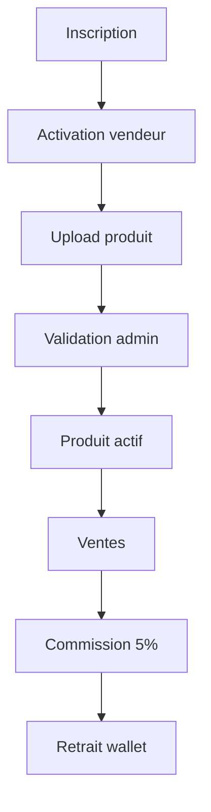
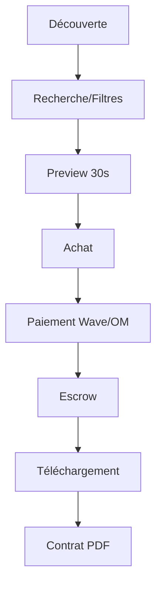

# Documentation Produit Linkart

> Version: v2.0 Auteur: Papa Diop Dernière mise à jour: 2025-10-27 Objet: Documentation
> fonctionnelle et vision produit pour la marketplace musicale Linkart

---

## 1. Vision Stratégique

**Linkart** est la **plateforme de référence pour les professionnels du son au Sénégal** et en
Afrique francophone.

### Mission

Créer un écosystème numérique complet permettant aux créateurs musicaux de :

- **Vendre** leurs productions (beats, samples, kits, services)
- **Acheter** des créations de qualité
- **Collaborer** avec d'autres professionnels
- **Monétiser** leurs talents de manière équitable

### Vision

Devenir la **marketplace musicale leader** en Afrique francophone, connectant tous les acteurs de
l'industrie musicale dans un écosystème sécurisé et profitable.

---

## 2. Utilisateurs Cibles

| Type d'utilisateur   | Description                             | Objectif principal      | Besoins clés                               |
| -------------------- | --------------------------------------- | ----------------------- | ------------------------------------------ |
| **Beatmaker**        | Crée et vend ses beats, samples, kits   | Monétiser ses créations | Visibilité, paiements sécurisés, contrats  |
| **Artiste**          | Achète des beats ou services            | Produire des morceaux   | Qualité, prix abordables, licences claires |
| **Ingénieur du son** | Propose services audio (mix, mastering) | Trouver des clients     | Portfolio, tarification, planning          |
| **Studio**           | Offre services d'enregistrement         | Optimiser l'occupation  | Réservations, paiements, visibilité        |
| **Manager/Label**    | Supervise achats et ventes              | Centraliser la gestion  | Analytics, contrats, équipes               |
| **Admin**            | Valide produits, retraits, modère       | Assurer la conformité   | Outils de modération, analytics            |

---

## 3. Parcours Utilisateurs

### 3.1 Parcours Beatmaker (Vendeur)

**Étapes clés :**

1. **Onboarding** : Création profil + activation capabilities `can_sell`
2. **Upload** : Beat/sample + preview 30s + métadonnées
3. **Validation** : Modération admin (qualité, droits)
4. **Vente** : Mise en ligne + boost optionnel
5. **Monétisation** : Commission 5% + retrait sécurisé

### 3.2 Parcours Artiste (Acheteur)

**Étapes clés :**

1. **Découverte** : Marketplace + recommandations
2. **Évaluation** : Preview + infos vendeur + ratings
3. **Achat** : Checkout + paiement sécurisé
4. **Escrow** : Fonds bloqués jusqu'à validation
5. **Livraison** : Téléchargement + contrat automatique

---

## 4. Modules Fonctionnels

### 4.1 Marketplace

- **Catalogue** : Beats, samples, kits, services
- **Recherche** : Par genre, BPM, prix, licence
- **Filtres** : Type, statut, rating, localisation
- **Tri** : Pertinence, prix, nouveauté, popularité

### 4.2 Système de Paiement & Escrow

- **Paiements** : Wave, Orange Money intégrés
- **Escrow** : Fonds bloqués jusqu'à validation
- **Commission** : 5% fixe sur toutes ventes
- **Retraits** : Validation manuelle admin

### 4.3 Upload & Gestion Produits

- **Upload** : Fichiers complets + preview 30s
- **Métadonnées** : Genre, BPM, licence, tags
- **Validation** : Modération qualité admin
- **Gestion** : Édition, suppression, statistiques

### 4.4 Système de Boosts

- **Boost Produit** : Mise en avant temporaire
- **Boost Profil** : Visibilité créateur
- **Tarification** : 2,000 F (7j) / 5,000 F (14j)
- **Effet** : Priorité dans résultats de recherche

### 4.5 Wallet & Retraits

- **Solde** : Affichage temps réel
- **Historique** : Transactions détaillées
- **Retraits** : Demande + validation admin
- **Sécurité** : Audit trail complet

### 4.6 Système de Ratings

- **Notation** : 1-5 étoiles + commentaires
- **Validation** : Achat confirmé requis
- **Modération** : Signalement + masquage admin
- **Impact** : Visibilité vendeur + confiance acheteur

---

## 5. Business Rules

### 5.1 Commission & Monétisation

- **Commission plateforme** : 5% fixe sur toutes ventes
- **Boost** : 0% commission (revenus directs)
- **Escrow** : Fonds bloqués jusqu'à validation
- **Retraits** : Validation manuelle admin

### 5.2 Sécurité & Conformité

- **Propriété intellectuelle** : Contrats PDF automatiques
- **URLs sécurisées** : Presigned URLs (TTL 15min)
- **Audit trail** : Logs complets toutes transactions
- **RGPD** : Suppression données sur demande

### 5.3 Qualité & Modération

- **Validation produits** : Admin obligatoire
- **Preview obligatoire** : 30s maximum
- **Métadonnées** : Genre, BPM, licence requis
- **Signalement** : Système de modération communautaire

---

## 6. KPIs & Métriques

### 6.1 Métriques Business

- **GMV** (Gross Merchandise Value) : Volume transactions
- **Commission revenue** : Revenus plateforme (5%)
- **ARPU** (Average Revenue Per User) : Revenus par utilisateur
- **Take rate** : % commission effective

### 6.2 Métriques Produit

- **DAU/MAU** : Utilisateurs actifs quotidiens/mensuels
- **Conversion rate** : % visiteurs → acheteurs
- **Upload success rate** : % uploads validés
- **Time to first sale** : Temps première vente

### 6.3 Métriques Qualité

- **Rating moyen** : Qualité produits/services
- **Dispute rate** : % transactions contestées
- **Support tickets** : Volume support client
- **Churn rate** : % utilisateurs perdus

---

## 7. Roadmap Produit

### Phase 1 - MVP (Q1 2025)

- ✅ Authentification OTP
- ✅ Upload produits + validation
- ✅ Marketplace + recherche
- ✅ Paiements Wave/OM + escrow
- ✅ Wallet + retraits
- ✅ Système ratings

### Phase 2 - Growth (Q2 2025)

- 🔄 Boosts avancés
- 🔄 Analytics vendeurs
- 🔄 Notifications push
- 🔄 Chat intégré
- 🔄 API publique

### Phase 3 - Scale (Q3-Q4 2025)

- 📋 Booking studios
- 📋 AI tagging automatique
- 📋 Intégration SODAV
- 📋 Multi-devises
- 📋 Mobile web

---

## 8. Concurrence & Positionnement

### Concurrents directs

- **Beatstars** : Leader mondial, cher
- **Splice** : Samples, pas beats complets
- **SoundCloud** : Streaming, pas marketplace

### Avantages concurrentiels Linkart

- **Prix local** : Adapté marché sénégalais
- **Paiements locaux** : Wave/OM intégrés
- **Support local** : Équipe francophone
- **Écosystème complet** : Services + produits

---

## 9. Changelog

### v2.0 (2025-10-27)

- Mise à jour complète selon les règles du projet
- Ajout des parcours utilisateurs détaillés
- Intégration des business rules complètes
- Définition des KPIs et métriques
- Roadmap produit structurée

### v1.0 (2025-10-22)

- Création de la structure de documentation produit
- Migration des spécifications existantes
