# Documentation Produit Linkart

> Version: v2.0 Auteur: Papa Diop Dernière mise à jour: 2025-10-27 Objet: Documentation
> fonctionnelle et vision produit pour la marketplace musicale Linkart

---

## 1. Vision Stratégique

**Linkart** est la **plateforme de référence pour les professionnels du son au Sénégal** et en
Afrique francophone.

### Mission

Créer un écosystème numérique complet permettant aux créateurs musicaux de :

- **Vendre** leurs productions (beats, samples, kits, services)
- **Acheter** des créations de qualité
- **Collaborer** avec d'autres professionnels
- **Monétiser** leurs talents de manière équitable

### Vision

Devenir la **marketplace musicale leader** en Afrique francophone, connectant tous les acteurs de
l'industrie musicale dans un écosystème sécurisé et profitable.

---

## 2. Utilisateurs Cibles

| Type d'utilisateur   | Description                             | Objectif principal      | Besoins clés                               |
| -------------------- | --------------------------------------- | ----------------------- | ------------------------------------------ |
| **Beatmaker**        | Crée et vend ses beats, samples, kits   | Monétiser ses créations | Visibilité, paiements sécurisés, contrats  |
| **Artiste**          | Achète des beats ou services            | Produire des morceaux   | Qualité, prix abordables, licences claires |
| **Ingénieur du son** | Propose services audio (mix, mastering) | Trouver des clients     | Portfolio, tarification, planning          |
| **Studio**           | Offre services d'enregistrement         | Optimiser l'occupation  | Réservations, paiements, visibilité        |
| **Manager/Label**    | Supervise achats et ventes              | Centraliser la gestion  | Analytics, contrats, équipes               |
| **Admin**            | Valide produits, retraits, modère       | Assurer la conformité   | Outils de modération, analytics            |

---

## 3. Parcours Utilisateurs

### 3.1 Parcours Beatmaker (Vendeur)

```mermaid
flowchart TD
    A[Inscription] --> B[Activation vendeur]
    B --> C[Upload produit]
    C --> D[Configuration multi-licences]
    D --> E[Validation admin]
    E --> F[Produit actif]
    F --> G[Ventes avec sélection licence]
    G --> H[Commission 5%]
    H --> I[Retrait wallet]
```

**Étapes clés :**

1. **Onboarding** : Création profil + activation capabilities `can_sell`
2. **Upload** : Beat/sample + preview 30s + métadonnées
3. **Configuration multi-licences** : Définition des différents types de licences et prix
4. **Validation** : Modération admin (qualité, droits)
5. **Vente** : Mise en ligne + boost optionnel
6. **Monétisation** : Commission 5% + retrait sécurisé

### 3.2 Parcours Artiste (Acheteur)

```mermaid
flowchart TD
    A[Découverte] --> B[Recherche/Filtres]
    B --> C[Preview 30s]
    C --> D[Sélection licence]
    D --> E[Achat]
    E --> F[Paiement Wave/OM]
    F --> G[Escrow]
    G --> H[Téléchargement]
    H --> I[Contrat PDF]
```

**Étapes clés :**

1. **Découverte** : Marketplace + recommandations
2. **Évaluation** : Preview + infos vendeur + ratings
3. **Sélection licence** : Choix du type de licence adapté au projet
4. **Achat** : Checkout + paiement sécurisé
5. **Escrow** : Fonds bloqués jusqu'à validation
6. **Livraison** : Téléchargement + contrat automatique

### 3.3 Parcours Prestataire de Services

```mermaid
flowchart TD
    A[Inscription] --> B[Activation services]
    B --> C[Configuration multi-tiers]
    C --> D[Portfolio upload]
    D --> E[Validation admin]
    E --> F[Service actif]
    F --> G[Réservations gratuites]
    G --> H[Messagerie client]
    H --> I[Prestation externe]
    I --> J[Évaluation]
```

---

## 4. Modules Fonctionnels

### 4.1 Modèle Produits (Beats/Kits)

- **Types** : Beats, samples, kits uniquement
- **Multi-Licences** : Chaque produit peut avoir plusieurs types de licences
  - **Basic** : Usage limité, prix abordable
  - **Non-Exclusive** : Usage commercial, prix moyen
  - **Exclusive** : Droits exclusifs, prix élevé
  - **Lease** : Location temporaire, prix réduit
- **Pricing** : Table `product_pricing` avec prix et termes par licence
- **Commission** : 5% fixe sur toutes les ventes
- **Escrow** : Fonds bloqués jusqu'à validation manuelle/admin

### 4.2 Système de Paiement & Escrow (Beats/Kits uniquement)

- **Paiements** : Wave, Orange Money intégrés
- **Escrow** : Fonds bloqués jusqu'à validation
- **Commission** : 5% fixe sur beats et kits UNIQUEMENT
- **Retraits** : Validation manuelle admin
- **Sélection licence** : Obligatoire avant paiement

### 4.3 Upload & Gestion Produits

- **Upload** : Fichiers complets + preview 30s
- **Métadonnées** : Genre, BPM, licence, tags
- **Configuration multi-licences** : Définition des prix et termes par licence
- **Validation** : Modération qualité admin
- **Gestion** : Édition, suppression, statistiques

### 4.4 Modules Services (Gratuits)

- **Types** : Mixage, mastering, enregistrement, production, coaching, sound design
- **Multi-Tarifs** : Chaque service peut avoir plusieurs options de tarification
  - **Prix fixe** : Tarif unique pour une prestation définie
  - **À la demande** : Prix négocié directement avec le client
  - **Multi-tiers** : Plusieurs options (Basic/Standard/Premium)
- **Pricing** : Table `service_pricing` avec prix et descriptions par tier
- **Commission** : 0% - Services complètement gratuits pour la plateforme
- **Paiements** : Externes (cash, Wave direct, Orange Money direct)
- **Réservation** : Système de booking intégré et gratuit
- **Messagerie** : Chat 1-to-1 activé après confirmation de réservation
- **Portfolio** : Upload d'exemples de travaux

### 4.5 Système de Boosts

- **Boost Produit** : Mise en avant temporaire (beats/kits/services)
- **Boost Profil** : Visibilité créateur
- **Tarification** : 2,000 F (7j) / 5,000 F (14j)
- **Effet** : Priorité dans résultats de recherche

### 4.6 Wallet & Retraits (Beats/Kits uniquement)

- **Solde** : Affichage temps réel
- **Historique** : Transactions détaillées
- **Retraits** : Demande + validation admin
- **Sécurité** : Audit trail complet

### 4.7 Système de Ratings (Produits ET Services)

- **Notation** : 1-5 étoiles + commentaires
- **Validation** : Achat confirmé requis (beats/kits) ou réservation complétée (services)
- **Modération** : Signalement + masquage admin
- **Impact** : Visibilité vendeur + confiance acheteur

> **Documentation complète** : Voir [Modèle Services Gratuits](./services-model.md)

---

## 5. Business Rules

### 5.1 Commission & Monétisation

- **Commission plateforme** : 5% fixe sur beats et kits UNIQUEMENT
- **Services** : Gratuits, pas de commission, paiements externes
- **Boost** : 0% commission (revenus directs)
- **Escrow** : Fonds bloqués jusqu'à validation (beats/kits)
- **Retraits** : Validation manuelle admin

### 5.2 Sécurité & Conformité

- **Propriété intellectuelle** : Contrats PDF automatiques
- **URLs sécurisées** : Presigned URLs (TTL 15min)
- **Audit trail** : Logs complets toutes transactions
- **RGPD** : Suppression données sur demande

### 5.3 Qualité & Modération

- **Validation produits** : Admin obligatoire
- **Preview obligatoire** : 30s maximum
- **Métadonnées** : Genre, BPM, licence requis
- **Signalement** : Système de modération communautaire

---

## 6. KPIs & Métriques

### 6.1 Métriques Business

- **GMV** (Gross Merchandise Value) : Volume transactions
- **Commission revenue** : Revenus plateforme (5%)
- **ARPU** (Average Revenue Per User) : Revenus par utilisateur
- **Take rate** : % commission effective

### 6.2 Métriques Produit

- **DAU/MAU** : Utilisateurs actifs quotidiens/mensuels
- **Conversion rate** : % visiteurs → acheteurs (beats/kits)
- **Upload success rate** : % uploads validés
- **Time to first sale** : Temps première vente
- **Services bookings** : Réservations créées/mois
- **Cross-selling rate** : % utilisateurs services → acheteurs beats

### 6.3 Métriques Qualité

- **Rating moyen** : Qualité produits/services
- **Dispute rate** : % transactions contestées
- **Support tickets** : Volume support client
- **Churn rate** : % utilisateurs perdus

---

## 7. Roadmap Produit

### Phase 1 - MVP (Q1 2025)

- ✅ Authentification OTP
- ✅ Upload produits + validation
- ✅ Marketplace + recherche
- ✅ Paiements Wave/OM + escrow
- ✅ Wallet + retraits
- ✅ Système ratings

### Phase 2 - Growth (Q2 2025)

- 🔄 Services gratuits + réservation
- 🔄 Messagerie conditionnelle (services uniquement)
- 🔄 Boosts avancés
- 🔄 Analytics vendeurs
- 🔄 Notifications push
- 🔄 API publique

### Phase 3 - Scale (Q3-Q4 2025)

- 📋 Booking studios
- 📋 AI tagging automatique
- 📋 Intégration SODAV
- 📋 Multi-devises
- 📋 Mobile web

---

## 8. Concurrence & Positionnement

### Concurrents directs

- **Beatstars** : Leader mondial, cher
- **Splice** : Samples, pas beats complets
- **SoundCloud** : Streaming, pas marketplace

### Avantages concurrentiels Linkart

- **Prix local** : Adapté marché sénégalais
- **Paiements locaux** : Wave/OM intégrés
- **Support local** : Équipe francophone
- **Écosystème complet** : Services + produits

---

## 9. Changelog

### v2.2 (2025-10-27)

- **Services gratuits** : Nouveau modèle économique avec services professionnels gratuits
- **Multi-pricing** : Système de tarification flexible pour beats/kits et services
- **Réservation intégrée** : Système de booking pour services avec messagerie conditionnelle
- **Architecture séparée** : Distinction claire entre produits payants et services gratuits
- **Commission ciblée** : 5% uniquement sur beats/kits, 0% sur services
- **Messagerie conditionnelle** : Chat uniquement pour services, protection revenus beats/kits

### v2.1 (2025-10-27)

- **Nouvelle stratégie services gratuits** : Commission 5% uniquement sur beats/kits
- **Système de réservation** : Booking intégré pour services
- **Messagerie conditionnelle** : Chat uniquement pour services
- **Modèle économique clarifié** : Services = acquisition, Beats/Kits = monétisation
- **Documentation services** : Ajout du modèle services gratuits

### v2.0 (2025-10-27)

- Mise à jour complète selon les règles du projet
- Ajout des parcours utilisateurs détaillés
- Intégration des business rules complètes
- Définition des KPIs et métriques
- Roadmap produit structurée

### v1.0 (2025-10-22)

- Création de la structure de documentation produit
- Migration des spécifications existantes
